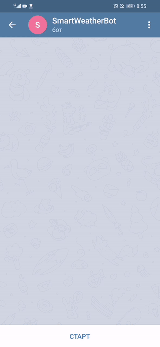

# SmartWeatherBot  ☂
Тестовое задание для "Школы будущих СТО" - Умный погодный Telegram Bot
Уровень сложности: срений Средний уровень сложности + задача со звездочкой
## Описание приложения

ASP NET CORE приложение включающий в себя REST клиент для получения данных о погоде и Телеграм бота, который общается с пользователями и сообщает им погоду. 
Функционал приложения позволяет:
  - Отобразить текущую погоду по известным координатам пользователя
  - Запрашивать и получать (с сохранение) координаты пользователя для предоставления данных о погоде
  - Предлагать подсказки в соответствии с текущей погодой

## Используемые технологии

  - Язык программирования C#, ASP.NET Core 3.1
  - SQLite 3 для работы с данными и их сохранением
  - Dapper, ORM для обращения к базе
  - Dommel - расширение стандартного функционала Dapper
  - Dapper.FluentMap.Dommel - маппер сущностей к базе данных
  - Microsoft.AspNet.WebApi.Client - для запросов и десериализации данных о погоде
  
## Пользовательский интерфейс

[](./demo.gif)


Сервис представлен ввиде Telegram бота, который хостится на ASP.NET
Пользователь находит Telegram бота и начинает с ним диалог. Пользователь может дополнительно предоставить свои координаты для предоставления более точных данныхъ о погоде.
Данные о температуре, давлении и скорости ветра, полученные с API подставляются в текстовый шаблон:
> Текущая температура: [температура]  
> Ощущается как: [температура]  
> Скорость ветра: [скорость] м/с  
> Влажность: [влажность] %  
> Давление: [давление] мм/ртс  
> [Интелектуальная подсказка]

Для уменьшения нагрузки и числа обращений к API погодного сервиса - данные о погоде кэшируются и обновляются по мере необходимости

## Как это работает

Данные приходят от пользователя через интерфейс мессенджера Telegram
1. Проверяется наличие пользователя в базе данных, если в базе пользователь отсутствует - создается новый пользователь с ID телеграмма
2. Сообщение проверяется на соответсвие допустимых команд, если команда не распознана - формируется соответствующее сообщение
3. Если пришла команда на получение погоды, формируется запрос данных из кэша или с сервиса погодного API
4. Данные о погоде подставляются в текстовой шаблон для формирования ответа
5. Сформированный ответ отправляется пользователю

## Как запустить

Вам потребуется создать [Telegram бота](https://core.telegram.org/bots#3-how-do-i-create-a-bot) (см. инструкцию на сайте Telegram), а так же 
зарегистрироваться на сайте погодного сервиса [OpenWeatherMap](https://openweathermap.org/guide) (см. инструкцию по ссылке), 
для получения токена, позволяющего получать данные о погоде

Для начала клонируйте проект из репозитория. У вас есть несколько вариантов:
1. Скачать и разархивировать ZIP архив;
2. Использовать кнопку "Open with Visual Studio", на странице репозитория;
3. Скопировать проект через Team Explorer в Visual Studio

Далее внесите изменения в файл appsettings.json, который находится в корне проекта,
через любой текстовой редактор или непосредственно в Visual Studio, указав полученные токены для телеграм бота и для погодного API

Запустите проекта, нажав CTRL+F5, или через консоль, введя следующую команду:
```sh
dotnet run -v m -p [PATH]
```

Где [PATH] - путь к файлу проекта. Например:
```sh
dotnet run -v m -p D:\source\SmartWeatherBot\SmartWeatherBot\SmartWeatherBot.csproj
```
